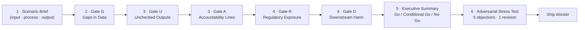

# GUARD Audit Dossier

> A board-ready AI risk assessment you built yourself — five gates, one Go/No-Go call, adversarial stress-tested.

  

## Build this yourself

Everything below is a reusable blueprint. Swap the bracketed tokens for your own scenario and paste the dossier block into your workspace of choice.

```text
# GUARD Audit — [YOUR SYSTEM NAME]
Auditor: [YOUR NAME] | Domain: [YOUR ROLE AND DOMAIN]

Gate G — Gaps in Data:        [LOW / MODERATE / HIGH / DEPLOYMENT-BLOCKING]
Gate U — Unchecked Outputs:   [LOW / MODERATE / HIGH / DEPLOYMENT-BLOCKING]
Gate A — Accountability Lines: [LOW / MODERATE / HIGH / DEPLOYMENT-BLOCKING]
Gate R — Regulatory Exposure: [LOW / MODERATE / HIGH / DEPLOYMENT-BLOCKING]
Gate D — Downstream Harm:     [LOW / MODERATE / HIGH / DEPLOYMENT-BLOCKING]

Overall risk rating: [LOW / MODERATE / HIGH / CRITICAL]
Recommendation:      [GO / CONDITIONAL GO / NO-GO]

Example (from this build):
  System: AI resume screener filtering entry-level warehouse applicants
  Gate G: HIGH RISK — historical hiring data encodes past exclusion patterns
  Gate U: HIGH RISK — bottom 60% filtered before any human review
  Gate A: HIGH RISK — vendor owns model; client HR team absorbs legal blame
  Gate R: HIGH RISK — GDPR Art. 22 automated-decision rights, EEOC disparate impact
  Gate D: HIGH RISK — third-order: regional labor market distortion over 5 years
  Overall: CRITICAL | Recommendation: NO-GO until bias audit and human-review gate added
```

## How this dossier was built

Six stages, one framework, zero hedging.



The GUARD framework forces you to name the mechanism of every risk — not just flag that risk exists. Gate G traces data gaps to silent populations. Gate U names the exact workflow step where outputs go unchecked. Gate A maps who absorbs blame versus who held power. Gate R cites real provisions, not law names. Gate D traces harm three orders deep until it reaches population-level effects. The adversarial stress test then makes you argue the other side until at least one objection forces a revision.

## This build

QA Tester Alpha audited **** and produced a complete five-gate dossier with a Go/No-Go recommendation.

- Dossier: [dossier.md](./dossier.md)
- Executive brief: [exec-brief.md](./exec-brief.md)
- Blank worksheet: [blueprints/worksheet.md](./blueprints/worksheet.md)
- Chat spawn: [blueprints/chat.md](./blueprints/chat.md)

## my-build/

Put screenshots, notes, and iteration history here.

---

Model-assisted draft — review before sharing.
